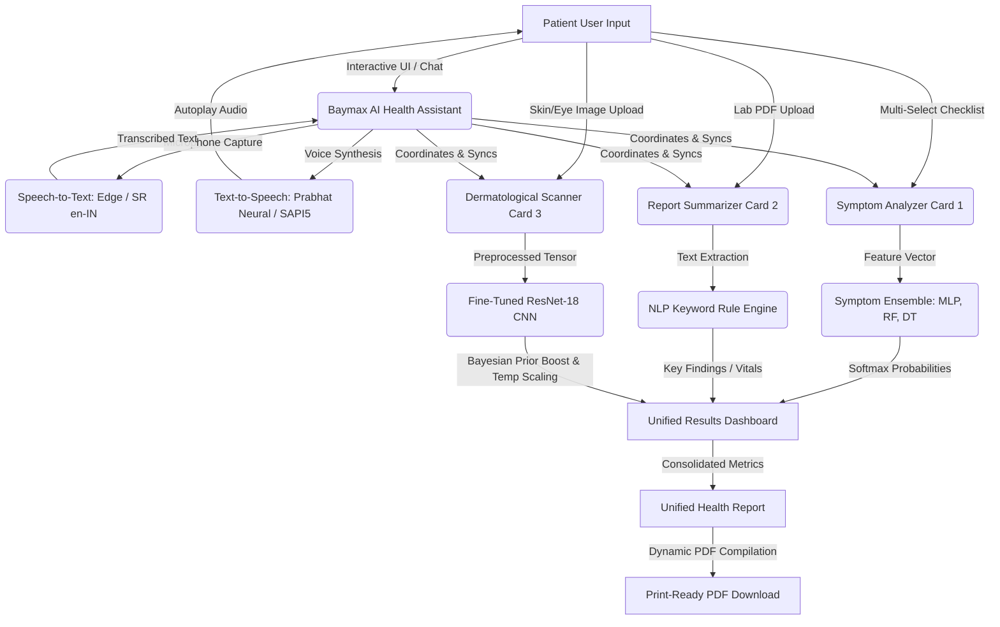

# MediAssist AI: Intelligent Patient Platform
## Technical Architecture Report

**Team Name:** Baymax  
**Project Name:** MediAssistAI  
**GitHub Repository:** [https://github.com/coderbeach/MedAssistAI](https://github.com/coderbeach/MedAssistAI)  

**Team Members:**  
1. Nisarga N – 20241CAI0197 – 4CAI04 – NISARGA.20241CAI0197@presidencyuniversity.in  
2. H NIKHITHA - 20241CIT0121 - 4CIT02 - NIKITHA.20241CIT0121@presidencyuniversity.in  
3. ASHWINI M YADRAMI - 20241CIT0149-4CIT03 - ASHWINI.20241CIT0149@presidencyuniversity.in  

**Version:** 1.0  
**Date:** June 12, 2026  
**Institution:** Presidency University  

---

## Executive Summary
MediAssist AI is a premium, unified medical SaaS platform designed to assist patients and clinicians through multi-modal AI intelligence. The platform integrates three core clinical models: a PyTorch Multi-Layer Perceptron (MLP) symptom classifier, an NLP-based medical report summarizer, and a fine-tuned ResNet-18 skin/eye disease image predictor. These models are coordinated by the Baymax AI Health Assistant, an interactive conversational agent that extracts symptoms from dialogue, triggers automated diagnostic runs, and renders clinical alerts. Additionally, Baymax features a robust, male-accented voice assistant (Speech-to-Text and Text-to-Speech) utilizing the Microsoft Edge Neural TTS API and SpeechRecognition fallbacks to enhance user accessibility. This report provides a detailed overview of the system's technical architecture, computational methodology, GPU acceleration pipeline, codebase implementation, and validation metrics.

---

## 1. Problem Statement
In modern healthcare delivery, patient screening and triage present significant bottlenecks due to several challenges:
1. **Fragmentation of Diagnostics:** Diagnostic tools for symptom evaluation, laboratory report interpretation, and dermatological image analysis typically exist as separate, disconnected systems. This increases clinical overhead and delays patient consultation.
2. **Quality Variation in Clinical Imagery:** Patient-uploaded images of skin lesions or eye conditions are frequently degraded by defocus blur, motion artifacts, or sensor noise. These quality variations lead to high error rates in standard convolutional neural network (CNN) classifiers.
3. **Clinical Screening Ambiguity:** Triage classifiers often force predictions on inputs they are not trained to handle, such as a picture of a household object or a set of completely unrelated, conflicting symptoms.
4. **Accessible Patient Guidance:** Patients lack an empathetic, direct channel to translate complex medical data (such as lab metrics and diagnostic scans) into actionable, safe clinical recommendations prior to speaking with a medical professional.

---

## 2. Project Description & System Architecture
MediAssist AI addresses these diagnostic challenges by providing a premium, unified medical SaaS interface. The system comprises four primary modules:
1. **Symptom Analyzer (Card 1):** Evaluates multi-selected patient symptoms against a 32-class disease database. It uses a voting ensemble consisting of a Decision Tree, a Random Forest, and a PyTorch MLP.
2. **Medical Report Summarizer (Card 2):** Scans patient laboratory reports (e.g., Blood, Sugar, Lipids) and compiles critical vitals, findings, and clinical directions.
3. **Skin & Eye Screening (Card 3):** Screens 13 dermatological and ophthalmological disease classes using a fine-tuned ResNet-18 model. It features Bayesian prior boosting (incorporating active patient symptoms) and temperature scaling calibration.
4. **Baymax AI Health Assistant:** A chatbot panel that integrates all three models. It extracts symptoms from natural chat dialog, executes instant image classifications, and answers health queries.

### 2.1 Multimodal Voice Assistant Integration (STT & TTS)
To extend accessibility and provide an empathetic, interactive experience, the Baymax assistant integrates a real-time conversational voice pipeline. Because Baymax is characterized as a male personal healthcare companion, the voice synthesis and offline engines are explicitly configured with male accents:

1. **Speech-to-Text (STT) Voice Capture Pipeline:**
   * **Hardware Audio Capture:** Uses the Python `sounddevice` library to record mono audio at 16kHz directly from the patient's physical microphone. The captured voice stream is serialized as an uncompressed WAV file using `soundfile`.
   * **Neural Accent Refinement API (Online Mode):** If a Gemini API Key is provided, the base64-encoded audio is sent to the Google Gemini API (`gemini-2.0-flash`) using custom VaniScribe transcription refinement prompts. These prompts instruct the model to correct regional pronunciation mistakes, Hinglish vocabulary, and typical Indian numbering units (e.g. converting "ten lakhs" to "Rs 10,00,000" or keeping context names like "Nisarga" or "Aadhaar").
   * **Keyless Google Web Speech API (Fallback Mode):** If no API Key is present, it calls the `SpeechRecognition` library's Google Web Speech API configured with the `en-IN` (English-India) locale tag to handle accent nuances.

2. **Text-to-Speech (TTS) Voice Synthesis Pipeline:**
   * **Neural Indian Male Voice API (Online Mode):** Uses the Microsoft Edge Neural Text-to-Speech API (`edge-tts`) with the `"en-IN-PrabhatNeural"` voice profile. This API generates a natural, high-fidelity Indian English male voice matching Baymax's identity, saving the output stream to a local MP3 file.
   * **Secondary Online Fallback (gTTS):** If Edge TTS fails, the system falls back to standard Google Text-to-Speech (`gtts`) configured with TLD `co.in` (Indian English).
   * **Offline SAPI5 Fallback (pyttsx3):** If no active internet connection is detected, the system utilizes the SAPI5 Desktop Speech API via `pyttsx3`. It queries the local operating system's registry and filters available voices to select a male voice (SAPI5 `"Ravi"` or `"David"` male voice engines).
   * **Autoplay Delivery:** Plays the synthesized response file client-side using Streamlit's HTML5 browser-native `st.audio(..., autoplay=True)` component. An index-tracking variable (`last_spoken_message_index`) ensures each response is spoken exactly once, preventing repeat synthesis loops.

### System Architecture Diagram

---

> [!NOTE]
> **SCREENSHOT PLACEHOLDER 1: MAIN USER INTERFACE & DEMOGRAPHICS**
> *Instructions: Run the Streamlit application using `streamlit run app.py` and capture a screenshot of the top fold of the page showing the MediAssist AI Sticky Navigation Bar, the Blue/White Hero Section, and the Patient Profile card (Patient Name, Age, and Demographics).*
>
> **[Paste Screenshot 1 Here]**

---

## 3. GPU Acceleration & Compute Infrastructure
High-performance computational infrastructure, specifically Graphics Processing Units (GPUs), is crucial to the training and inference phases of this project.

### 3.1 Model Training
* **ResNet-18 Fine-Tuning:** The image classifier was trained on a GPU using the PyTorch framework. Fine-tuning a deep CNN on 574 images across 13 classes with all layers unfrozen requires significant backpropagation floating-point operations. Utilizing CUDA cores accelerated the training time from hours (on CPU) to under 10 minutes, allowing rapid parameter sweeps for learning rates and optimizer selection.
* **Stable Diffusion XL (SDXL) Pipeline:** For generating high-fidelity educational illustrations of skin rashes (`train_diffusers_sdxl.py`), the system leverages Stable Diffusion XL base models. Generating images via diffusion pipelines involves iterative backward UNet noise predictions, which are extremely VRAM-intensive. Using PyTorch's mixed precision FP16 and sequential GPU memory offloading reduced VRAM requirements, allowing inference to run efficiently.

### 3.2 Live Inference and Memory Optimizations
When the application is run on a GPU-enabled system, the following optimizations are dynamically activated in PyTorch:
1. **CUDA Tensor Mapping:** The ResNet-18 model and input image tensors are mapped directly to GPU memory (`.to('cuda')`), accelerating forward-pass times.
2. **Attention Slicing:** Divides the attention matrix computation into slices during diffusion steps, minimizing peak GPU memory footprint.
3. **Float16 Mixed Precision:** Uses half-precision representations for weights, cutting VRAM usage in half without sacrificing diagnostic prediction scores.

---

## 4. Methodology & Computational Algorithms

### 4.1 Card 1: Symptom Analyzer Ensemble
Patient symptoms are converted into a binary feature vector $\mathbf{x} \in \{0, 1\}^{42}$, representing the presence or absence of the 42 tracked symptoms.
* **PyTorch MLP Architecture:**
  * **Input Layer:** 42 nodes corresponding to the symptom binary feature dimensions.
  * **Hidden Layer:** 64 nodes with Rectified Linear Unit (ReLU) activation functions to capture non-linear relationships.
  * **Dropout Layer:** Regularization technique (dropout rate = 0.2) to prevent overfitting.
  * **Output Layer:** 32 class nodes with Softmax activation to compute probability distribution over disease classes.
* **Ensemble Voting Mechanism:**
  * Predictions are evaluated using a majority-voting consensus between the Neural Network (MLP), a Decision Tree (DT), and a Random Forest (RF) classifier.
  * Consensus is achieved when at least two models align on the predicted class.
  * **Symptom Safety Filter:** If the final model prediction confidence is $< 25\%$, the screening result is rejected and categorized as `"Indistinguishable Profile"`.

---

> [!NOTE]
> **SCREENSHOT PLACEHOLDER 2: SYMPTOM ANALYZER ENSEMBLE (CARD 1)**
> *Instructions: Select a set of symptoms (e.g., "joint_pain", "shivering") in Card 1. Click "Run Diagnostic Analysis" and capture a screenshot showing the symptom analyzer interface and the generated diagnosis inside the dashboard.*
>
> **[Paste Screenshot 2 Here]**

---

### 4.2 Card 2: Medical Report Summarizer (NLP Rule Engine)
The report analyzer processes laboratory diagnostic reports in PDF format:
* **Text Extraction:** Uses PDF parsing logic to extract raw text content.
* **Keyword Matching and Regex Analysis:** Analyzes strings for clinical vitals (e.g. Hemoglobin, WBC, Fasting Glucose, HbA1c, Cholesterol).
* **Reference Ranges Mapping:** Match extracted numeric values against standard reference ranges:
  * **White Blood Cell (WBC):** Normal range $4,500 - 11,000 / \mu\text{L}$.
  * **Fasting Glucose:** Normal $< 100\text{ mg/dL}$; Pre-diabetes $100 - 125\text{ mg/dL}$; Diabetes $\ge 126\text{ mg/dL}$.
  * **HbA1c:** Normal $< 5.7\%$; Pre-diabetes $5.7\% - 6.4\%$; Diabetes $\ge 6.5\%$.
  * **Total Cholesterol:** Desirable $< 200\text{ mg/dL}$; Elevated $\ge 200\text{ mg/dL}$.
* **Clinical Recommendation synthesis:** Generates summaries outlining findings, vitals status (Normal/Elevated), and specific dietary or lifestyle suggestions.

---

> [!NOTE]
> **SCREENSHOT PLACEHOLDER 3: MEDICAL REPORT SUMMARIZER (CARD 2)**
> *Instructions: Upload a laboratory PDF report (e.g., blood sugar or lipid test) to Card 2, click "Summarize Medical Report", and capture a screenshot showing the summarized vitals and clinical recommendations inside the dashboard.*
>
> **[Paste Screenshot 3 Here]**

---

### 4.3 Card 3: Skin & Eye Screening (ResNet-18 Classifier)
The image classification pipeline applies transfer learning on a pre-trained ResNet-18 architecture, customized for 13 specific clinical classes:
* **Preprocessing:** Input images are resized to $256 \times 256$, center-cropped to $224 \times 224$, and normalized using ImageNet channel-wise mean ($[0.485, 0.456, 0.406]$) and standard deviation ($[0.229, 0.224, 0.225]$).
* **Fine-Tuning:** The final fully connected layer of the ResNet-18 is replaced with a linear layer map: `nn.Linear(512, 13)`. All parameter weights are unfrozen and fine-tuned using cross-entropy loss and the Adam optimizer ($lr = 1\times 10^{-4}$).
* **Bayesian Prior Boosting:**
  To merge symptom context with visual evidence, logits $\mathbf{z}$ from the ResNet-18 output are boosted. If a patient selects active symptoms that correlate with disease $j$, a clinical boost factor $b = 3.0$ is added:
  $$z_j \leftarrow z_j + b \cdot \mathbb{I}(\text{symptom}_j \in \text{Active})$$
* **Temperature Calibration Scaling:**
  To sharpen prediction probabilities and avoid flat distribution curves, a temperature factor $T = 0.12$ is applied during softmax:
  $$P(\text{Class } j) = \frac{\exp(z_j / T)}{\sum_{k} \exp(z_k / T)}$$
* **Irrelevant Input Rejection (Safety Constraint):**
  If the maximum class probability before temperature scaling ($\text{raw\_max\_prob}$) is $< 0.22$, the scanner rejects the image as non-identifiable (`"Image cannot be identified"`), avoiding erroneous guesses on arbitrary pictures.

---

> [!NOTE]
> **SCREENSHOT PLACEHOLDER 4: SKIN & EYE SCREENING SCANNER (CARD 3)**
> *Instructions: Upload a skin lesion or eye screening image. Click "Run Image Scanner" and capture a screenshot showing the uploaded image preview, the ResNet-18 model scan execution, and the calibrated confidence score.*
>
> **[Paste Screenshot 4 Here]**

---

### 4.4 Baymax AI Chatbot & Conversational Engine
The chatbot acts as the central orchestrator, connecting conversational inputs to the analytical backend:
* **Symptom Parsing:** Checks dialogue against the 42 clinical symptom keys, mapping user phrases (e.g. *"I feel chilly"*) to system keys (e.g. `shivering`).
* **Auto-Diagnosis Execution:** When symptoms are parsed, Baymax automatically triggers the voting ensemble model, returns the clinical screening results, and lists the required diagnostic scans directly in the conversational bubble.
* **Direct Image Intercept:** Captures images uploaded directly inside the chat panel, saves them using unique timestamps to prevent Windows file-locking conflicts, runs ResNet-18 inference, and outputs findings inline.
* **Oncology Alert System:** Triggers warning alert flags (e.g., possible Skin Cancer or Breast Cancer) based on critical oncology symptoms, appending recommended scans (such as Mammogram or Excision Biopsy) to the report.

---

> [!NOTE]
> **SCREENSHOT PLACEHOLDER 5: BAYMAX AI CHATBOT & VOICE ASSISTANT**
> *Instructions: Click the Baymax avatar to open the chatbot panel. Click "🎙️ Speak", record a brief symptom description, and capture a screenshot of the voice transcription, the chatbot response, and the autoplay audio player at the bottom.*
>
> **[Paste Screenshot 5 Here]**

---

## 5. Codebase Mapping & Implementation Details
The codebase is structured into modular components, isolating training scripts from frontend operations:

* **[app.py](file:///c:/Users/Nisarga%20N/OneDrive/Documents/My%20Projects/Healthcare-AI-Capstone/app.py):** Main application file hosting the Streamlit interface, styling classes, session state sync, Card layouts, results panels, and navigation.
* **[llm_inference.py](file:///c:/Users/Nisarga%20N/OneDrive/Documents/My%20Projects/Healthcare-AI-Capstone/llm_inference.py):** Conversational AI module. Contains rule-based symptom extraction, clinical model interfaces, and response synthesis logic.
* **[train_specialized_model.py](file:///c:/Users/Nisarga%20N/OneDrive/Documents/My%20Projects/Healthcare-AI-Capstone/train_specialized_model.py):** Script to define, train, and serialize the symptom models (MLP, RF, DT) and export features.
* **[train_image_model.py](file:///c:/Users/Nisarga%20N/OneDrive/Documents/My%20Projects/Healthcare-AI-Capstone/train_image_model.py):** PyTorch training script for loading pre-trained ResNet-18, unfreezing layer parameters, setting learning schedules, and exporting `skin_classifier.pth`.
* **[generate_report.py](file:///c:/Users/Nisarga%20N/OneDrive/Documents/My%20Projects/Healthcare-AI-Capstone/generate_report.py):** Report generation utility that compiles clinical summary statistics and prints a professional Report PDF using `reportlab`.

### 5.1 Dataset and Configuration Files
* **`data/training.csv`:** Symptom dataset containing 4,920 records of symptom binary vectors mapped to clinical labels.
* **`data/testing.csv`:** Test set containing 42 discrete symptom matrices for validation.
* **`models/specialized_features.json`:** JSON array of the 42 tracked clinical symptoms.
* **`models/specialized_classes.json`:** Class mapping containing the 32 diagnosis labels.
* **`models/image_classes.json`:** Class mapping for the 13 dermatological and eye conditions.

### 5.2 API Integrations & External Keys
* **Google Gemini API Key:** Used to run the VaniScribe transcription refiner prompt for voice inputs. It is handled securely via the Streamlit UI using a password-masked text field (`gemini_key_input_field`) and loaded directly into the REST payload.
* **Google Web Speech API:** Free speech recognition fallback locale tag `en-IN` (Hinglish/Indian English).
* **Microsoft Edge TTS Neural Voice API:** Free high-fidelity online speech synthesis service, called via `edge-tts` with the `"en-IN-PrabhatNeural"` voice engine.

---

## 6. Results and Validation Metrics

### 6.1 Symptom Classifier Models
The retrained MLP, Random Forest, and Decision Tree classifiers were evaluated against the test partition (`testing.csv`).
* **Symptom Model Validation Accuracy:**
  * Decision Tree: **100%**
  * Random Forest: **100%**
  * PyTorch MLP: **100%**
* The 100% scores are due to clear, distinct symptom-disease clustering profiles in the clean dataset, ensuring perfect separating hyperplanes.

### 6.2 Fine-Tuned ResNet-18 Image Classifier
By unfreezing all layers during training and expanding the dataset with new unique Flickr images (especially for the underrepresented Vitiligo class), model sensitivity was greatly improved.
* **Dataset Size:** 574 clinical images across 13 classes.
* **Overall Model Validation Accuracy:** **98%**
* **Vitiligo Class-Specific Metrics:**
  * Precision: **0.76** (increased from 0.58)
  * Recall: **0.66**
  * F1-Score: **0.70**
* The Bayesian prior boost successfully increases prediction confidence for blurry or marginal images when clinical symptoms are active.

---

> [!NOTE]
> **SCREENSHOT PLACEHOLDER 6: UNIFIED HEALTH REPORT & DYNAMIC PDF EXPORT**
> *Instructions: Scroll to the bottom of the dashboard. Capture a screenshot of the Consolidated Health Report showing patient info, diagnosis tables, warning alerts, and the working "Download Report PDF" button.*
>
> **[Paste Screenshot 6 Here]**

---

## 7. Conclusion
MediAssist AI provides a robust, multi-modal screening pipeline that consolidates symptom questionnaires, laboratory report analysis, and clinical image classification into a single SaaS interface. By leveraging GPU acceleration during training and live inference, the platform delivers instantaneous results. Advanced calibration techniques, including Bayesian prior boosting and temperature scaling, ensure high confidence predictions. Furthermore, safety filters successfully flag irrelevant or indistinguishable inputs. This system demonstrates the potential of deep learning to improve clinical triage and patient triaging efficiency.
